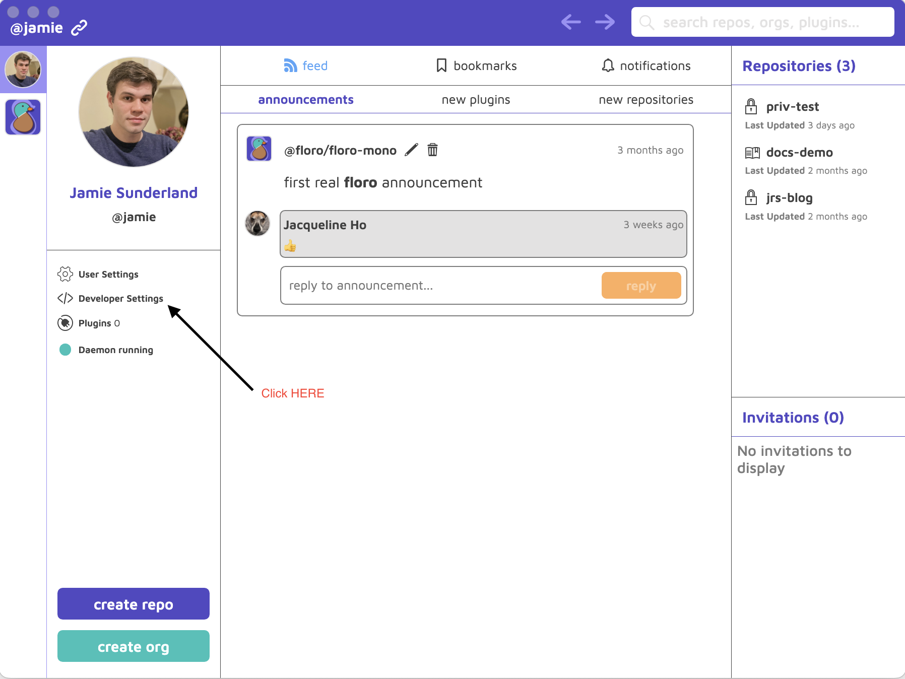
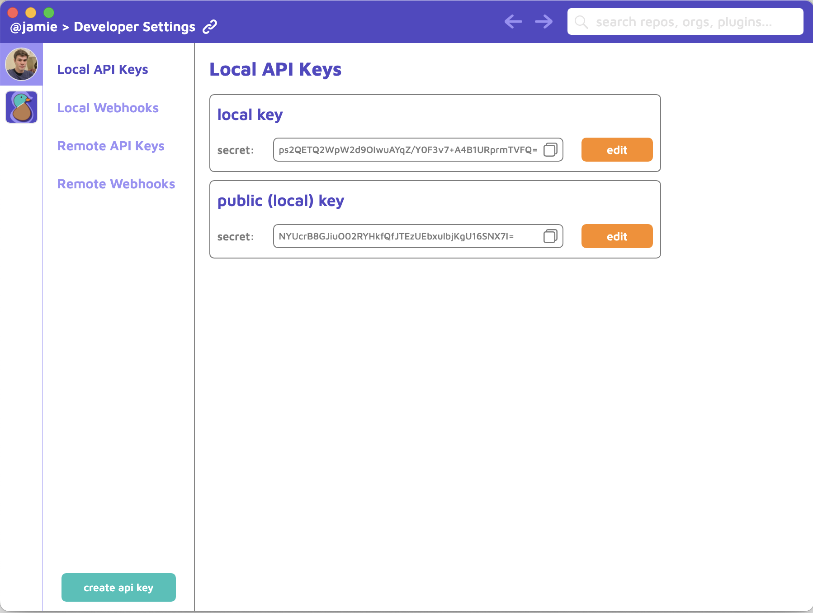
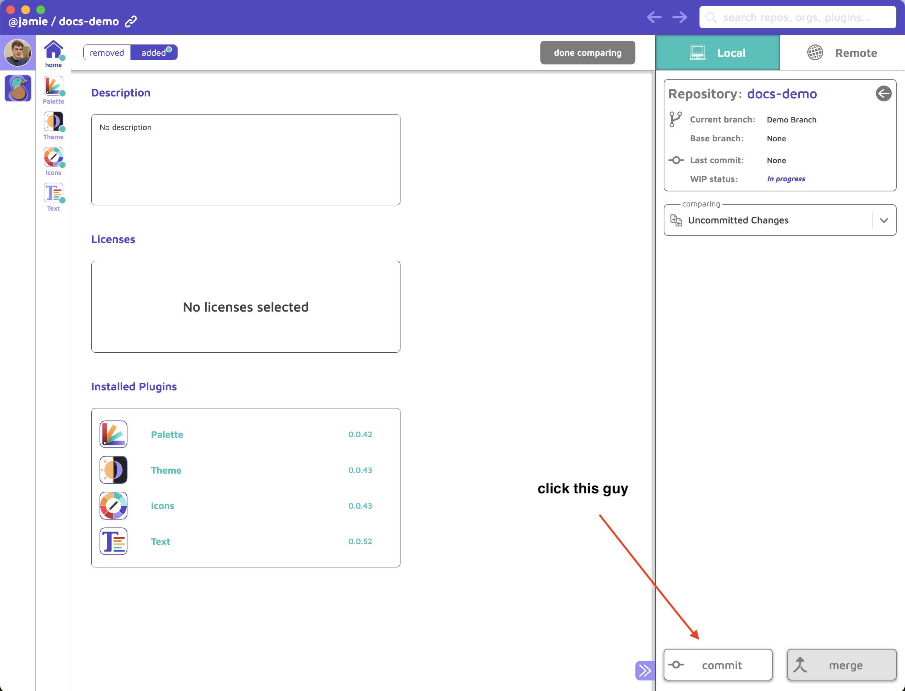
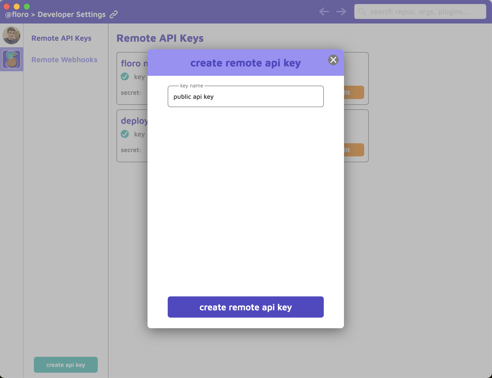
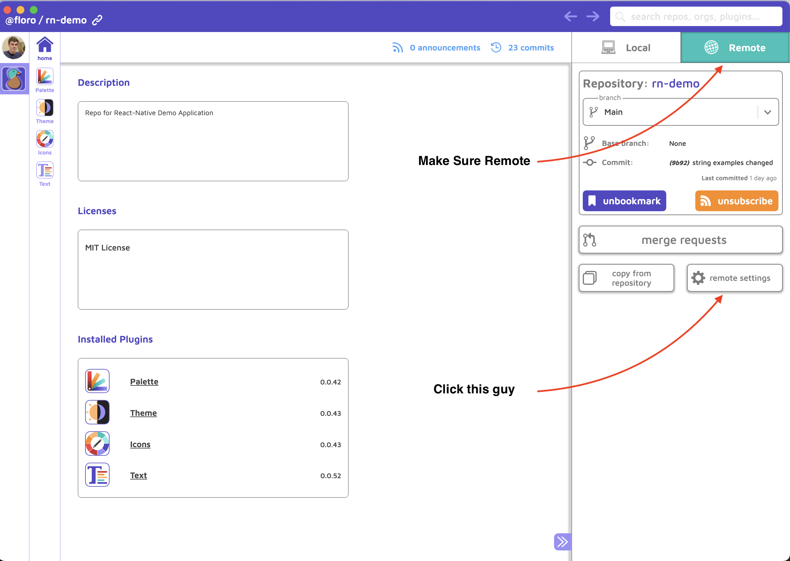
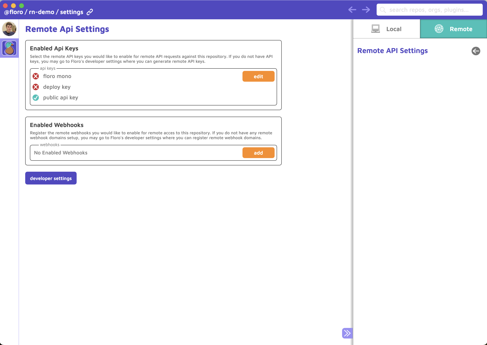

# Floro Demo React Native App

This repository should serve as both a demo and a guide for integrating Floro into your own application. This demo is built with expo and eas but all floro related code should be easily portable to all RN projects. It is easiest to get the demo to work first and then copy parts of the demo code into your own application.


## Getting the Demo to work (Part 1)

You will need the floro cli to build the floro modules

```bash
npm install -g floro
```


#### System Prerequisites
Java 17 (for android), built with node v19.9.0 (not sure if that matters)

#### Setup

```bash
yarn
```

```bash
floro module build -m floro_infra/floro.module.js
```

```bash
npx expo run:ios --device
```
OR
```bash
npx expo run:android --device
```

### Install Floro
If you want to actually experience the demo in full, please download the Floro Desktop app from [Floro](https://floro.io) if you haven't already

#### Clone the Floro Repository in Floro
Next clone the repository for this project
[Clone Floro Repo Here](https://floro.io/app-proxy/repo/@/floro/rn-demo).

(This will only work when the Floro desktop client is running)

### Create a Local API Key in Floro
Click developer settings once you are logged into Floro



Click on "create api key" (the green button in the lower left). Name your key whatever you want!



### Attach the API Key to the rn-demo repository


[Open the @floro/rn-demo Repo Here](https://floro.io/app-proxy/repo/@/floro/rn-demo?from=local).


Click on the "local settings" tab


Enable the Local API Key you created in the previous step

### Install Floro TLS Certs on your Phone

From the Floro desktop application click on the "Daemon Running Tab"


### Scan the QR from your Phone


#### Your TLS certs will change everytime you switch IPs on your lan. Certs are rotated every 6 months. Ie. You do not need to repeat these steps but if you've trusted a cert before from 192.168.1.x but never trusted floro from 19.2.168.1.y, you will have to download the cert for 192.168.1.y.


## Trusting a cert on IOS

#### After scanning the QR, download the cert

(only tested with Safari, might work with other browsers)


#### Open your IOS Settings


#### Insall the cert, by clicking the install button in the upper left corner (You will have to enter your passcode)

The Cert will not say "verified" on your phone until you trust it. That's okay! You made the cert on your own machine, it's safe to trust.


<i>Thought you were done?</i> The ghost of Steve Jobs has different plans for you.

#### Now search for "Trust Certifcates" in your Settings


#### Open up the "General -> About" section and scroll to the bottom, until you see "Certificate Trust Settings"


#### Finally turn on Full Trust for the certificate(s)


## Trusting a cert on Android
Trusting on Android is a little bit more straightforward than IOS but less uniform. I have a kind of old Samsung, so this may be easier for newer phones.

#### Scan the QR from your favorite QR code scanner app
If that isn't an option enter the url http://<your_desktop_local_ip>:63404/cert

<i>(NOTE: http, not https)</i>


#### Download the cert and name it to whatever you like ("Floro Cert" is fine)
For <b>Used For</b>, make sure you choose <b>VPN and apps</b>


You're done but in case you need to remove it or want to rename it, you can find it in your settings, it should be under <b>User Certificates</b>


## Running the demo


### <a href="https://www.youtube.com/watch?v=Om-k08GDoZ4">You can watch the following demo on YouTube to get an idea of how to setup the demo environment</a>

[](https://www.youtube.com/watch?v=Om-k08GDoZ4)

When scanning the QR from Floro, make sure it is the API QR and not the TLS QR


Select the local api key you attached to the floro repository


### Third Party API Keys

The plugins shown in this application that interact with APIs are all BYOK.

All API Keys are stored client side (on your machine) and never on the Floro servers. We do have to send your third party API keys in requests to our servers to overcome CORS limitations from DeepL and OpenAI. The controller code for the ML APIs can be found here <a href="https://github.com/florophore/floro-mono/blob/main/packages/backend/src/controllers/proxy/ChatGPTController.ts">ChatGPTController.ts</a> and here <a href="https://github.com/florophore/floro-mono/blob/main/packages/backend/src/controllers/proxy/DeepLProxyController.ts">DeepLProxyController.ts</a>. They are also only accessible by the text plugin (as shown in the demo). Every plugin has it's own version of local storage that can be cleared by you.

If you want to play around with translating between languages, you will need a DeepL API Key (they offer a free plan that works with Floro if you don't already have an account). See the <a href="https://support.deepl.com/hc/en-us/articles/360020695820-Authentication-Key">DeepL API Key docs</a>.

If you want to play around with the ChatGPT features (this includes automatic pluralization & genderization, term detection, as well as general suggestion prompting), you will need to supply your own OpenAI API key. See the <a href="https://platform.openai.com/docs/quickstart?context=curl">OpenAI Api Key docs</a>.


### Plugin Documentation

For documentation focused specifically on the plugins Demonstrated in this demo, please consult the <a href="https://floro.io/docs">Floro Documentation</a>.


## Integrating Floro Into Your Project (Part 2)

If you're convinced you're ready to test Floro out in your own application you need to take a couple of things into consideration.

Floro can be incrementally integrated into your app. I strongly recommend not converting your entire project in one giant PR.


### Do you want offline live edits?

If this is a feature you desire, you need to work with your designer/product manager/yourself to design some mechanism for displaying the modal with the QR that connects to your desktop and the edit and debug options.

### Do you want offline live edits on android?

If you do, you need to alter your `android/main/AndroidManifest.xml`

to

```xml
...
  <application
   android:name=".MainApplication"
   ...
   android:networkSecurityConfig="@xml/network_security_config">
   ...
 </application>
...
```

then add a file called `android/main/res/xml/network_security_config.xml`

Ours looks like this
```xml
<?xml version="1.0" encoding="utf-8"?>
<network-security-config>
    <base-config cleartextTrafficPermitted="true">
        <trust-anchors>
            <certificates src="system" />
            <certificates src="user" />
        </trust-anchors>
    </base-config>
</network-security-config>
```

You probably should not have `cleartextTrafficPermitted="true"` for production but you do need your `<base-config>` to allow for trusting of user-certificates if you want to be able to test copy changes in production builds. Do NOT put `<certifcates src="user">` in a `<debug-overrides>` if you want live offline testing in your production application. You may want to consult your security team if this something you want to do.

There may be better solutions for integrating network-security policies with Expo&EAS than the method described above.

<a href="https://stackoverflow.com/questions/55372642/how-to-add-network-security-config-xml-to-manifest-in-expo-app-without-ejecting">This guy on SO had a good example of how to do this in EAS.</a>


## Product Design Work You Need to Do

### Prequisites

You will have to make sure that you enable Camera permissions.

IOS `info.plist`

```xml
<key>NSCameraUsageDescription</key>
<string>$(PRODUCT_NAME) needs access to your Camera.</string>
```

Android `AndroidManifest.xml`

```xml
<uses-permission android:name="android.permission.CAMERA" />
```

- ## QR Modal Design
- 

- We have provided two modals for you to copy and paste (either use the `ExpoCamera` if you are using expo go or already have expo camera installed, or the `VisionCamera` if your project is bare bones or you already have vision camera installed). You can also roll your own component and use either file as a template. <i>This demo uses Vision Camera but they are identical implementations</i>.

  - <b>Expo Camera</b>
    - `src/screens/FloroModalExpoCameraScreen.tsx`
  - <b>Vision Camera</b>
    - `src/screens/FloroModalVisionCameraScreen.tsx`


- ## Triggering Unlock Debug Mechanism
- 

- In the demo, we allow you to tap the home screen text 7 times to unlock "debug mode". You will need to add something like this to your app if you want internal users (employees) to be able to test offline floro edits in your application. Here are few possible mechanisms to consider

  - Tap (n) times on hidden text to enabled "debug mode"
    - feel free to copy the context we created for this in `src/contents/DebugCounterContext.tsx`
  - Feature flagging on user ids to enable "debug mode" for certain users. If you already have feature flag capabilities this is easy to add. Otherwise, this is trivial to build as a floro plugin ;-) yourself.
  - Only ship debug mode in test flight applications (this can be accomplished with build flags) or <a href="https://github.com/communitybuilders/react-native-test-flight">react-native-test-flight</a>

- ## Triggering Debug Modal UI Placement
- 
- If possible you should place the debug button that opens the modal in a header, footer, or in a hamburger menu. It can be tedious to have to go through many navigation steps to enable and disable debug mode


### What plugin features do you want/need?

There are some features not explicitly demonstrated in the demo. You can, for example, make your app check for new translations every time it launches and update the strings (that are SAFE TO UPDATE) if they are on the <b>main floro remote branch head</b>.

- ### Palette
  - Do you want to be able to change every color in your app? I do not personally use this feature in the floro.io website but there may be some benefit if you have a designer on your team who changes colors often or if you have an expansive color palette. This is mostly an upstream plugin dependency but does not need to be included as a generator at runtime (for most apps).

- ### Themes
  - Do you want to use the theme colors provided by the floro themes plugin (you can still have themed SVG icons, without needing to use floro themes in your stylesheets). You could definitely do a little bit of work to get themes to works with react-native-unistyles, but this is something you'd have to build yourself if you don't want to use the default provided code from this demo.

- ### Icons
  - Icons are really useful because they can be themed fairly complexly. You can also make your icons have color varirants, such as when an icon is hovered or pressed down.

- ### Text
  - Text is probably my favorite plugin. It's also the only plugin I would consider live production updates a good idea for. The integration effort is slighly different for Text than the other 3 plugins.


### What node Dependecies do you need?

- `gorhom/portal`
    - needed if you want live offline edits for text
- `react-native-screens`
    - needed if you want live offline edits for text (ios needs this for displaying the debug popup)
- `@react-native-async-storage/async-storage`
    - Not needed if you have some other persistent storage preferred. I provided a Mock Class you can implement with your own persistence mechanism here `src/helpers/AsyncStorage.tsx`
- `@react-navigation/native/*`
    - Not needed but you will have to replace the useNavigation, with your own navigator in the QR modal if using `src/screens/FloroModalExpoCameraScreen.tsx` or `src/screens/FloroModalVisionCameraScreen.tsx`.
- `expo/*`
    - Not needed unless using `src/screens/FloroModalExpoCameraScreen.tsx`
- `react-native-dotenv`
    - Only needed if you need live production updates from a floro main branch. If you don't want to do polling for updates you don't need this. Furthermore you can use any ENV_VAR alternative. The only file this is used is `floro_infra/contexts/text/FloroTextContext.tsx`. This should be trivial to replace.
- `react-native-svg` && `react-native-svg-transformer` (dev dep)
    - Needed for icons/themed icons
- `react-native-vision-camera`
    - Needed if not expo (explained thoroughly above)
- `socket.io-client`
    - Needed for offline live edits & debug
- `ts-morph` (dev dep)
    - Only needed if you need live production updates from a floro main branch. Why? We need to do static analysis when syncing text at build time, in order to determine which strings are safe to update when a live production update occurs.
- `@floro/palette-generator`
    - Needed for floro palette
- `@floro/themes-generator`
    - Needed for floro themes
- `@floro/icons-generator`
    - Needed for floro icons
- `@floro/text-generator`
    - Needed for floro text


## Integrating the Code

The easiest thing to do is just copy the entire floro_infra directory from the root of this repo into the root of your project. If you need help reach out to me on <a href="https://discord.com/invite/VJ8Mhjd9Gw">discord</a>, I'll do my best to respond ASAP. We can hop on a zoom call if you get stuck.


```bash
cp -R ./floro_infra <path/to/your_project/top_level_directory>/floro_infra
cd <path/to/your_project/top_level_directory>
```

If possible I would include the following dependencies (you can remove the ones you don't need later)

```bash
yarn add @floro/icon-generator @floro/palette-generator @floro/text-generator @floro/themes-generator
yarn add @gorhom/portal
yarn add @react-native-async-storage/async-storage
yarn add react-native-dotenv
yarn add --dev react-native-svg-transformer
yarn add socket.io-client
yarn add --dev ts-morph

```

Here are the installation docs for integrating <a href="https://github.com/kristerkari/react-native-svg-transformer">react-native-svg-transformer</a>


Here are the installation docs for integrating <a href="https://www.npmjs.com/package/react-native-dotenv">react-native-dotenv</a>

To your babel.config.js or .babelrc

add the following to your plugins block

```js
module.exports = function(api) {
  api.cache(true);
  return {
    ...
    plugins: [
        ...
      ["module:react-native-dotenv", {
        "envName": "APP_ENV",
        "moduleName": "@env",
        "path": ".env",
        "safe": false,
        "allowUndefined": true,
        "verbose": false
      }]
    ],
    ...
  };
};
```

make two files

```bash
touch env.d.ts
touch .env
touch .env.development #see react-native-dotenv docs (https://www.npmjs.com/package/react-native-dotenv) to  decide if this is right for your project
```
in `env.d.ts` add
```ts
declare module '@env' {
  export const API_HOST: string;
  export const API_KEY: string;
  export const IS_DEV_MODE: string;
}
```
<b>We'll worry about the .env later (we don't need it yet)</b>


In the entry of your application (App.tsx or App.jsx) add the following

```tsx
...
// see example project src/Main.tsx
import FloroMount from '../floro_infra/contexts/FloroMount';
import {PortalProvider} from '@gorhom/portal';
...

const Main = () => {

  ...

  return (
    <FloroMount>
      <PortalProvider>
        ... your-app-mounting code
      </PortalProvider>
    </FloroMount>
  );
};

export default Main; // this probably is called App.tsx in your project
```


## Pointing at your Floro Repo


Before we start ripping things out, we should make sure everything builds correctly. To do that run the following

```bash
# cwd = project root
cd floro_infra
floro module sync -b
```

If you see
```bash
synced repo and wrote meta file to /path/to/repo/YourAppName/floro_infra/meta.floro.json
running post process..
build succeeded!
```
Then we are good! Hopefully you're already on a branch but if not, make a branch and commit here (in git).

Let's proceeed!

### Create a Floro Repository (if you haven't already)

If you are working on your project on behalf of an organization and intend to have multiple collaborative stakeholders, you should probably start an organization in floro and create the repository under the organization's account. At the time of writing this repositories cannot be transferred (they can be copied though). If you are a solo developer and don't expect to need to give edit permission to many others, feel free to create a personal repository. All personal and public (including organization) repositories are free of charge without any feature restrictions on floro.io, no payment details required.

From either your "home dashboard" or your "organization's dashboard" click <b>create repository</b> in the lower left hand corner of the screen.


Give your repo a name and create it


With the desktop client running, click the following link (this won't work on safari), <a href="https://floro.io/app-proxy/repo/@/floro/rn-demo?from=remote">floro react native demo repo</a>. Alternatively, you can search for the repo "rn-demo" in the floro search bar in the upper right corner.


Choose the repository you want to copy into (in this example, it is @jamie/docs-demo).


Select all the plugins, DO NOT CHOOSE manual copy (if you're curious what that does <a href="https://floro.io/docs">read the docs</a>).


Now, click paste into.


You've now copied over all the state from the demo to your repo. Now we need to commit it. click on the compare icon.



Commit your state


After you write a commit message and commit your changes, we're finally ready to get back to the code! Almost there!

## Connecting your project with your Floro repository

Open up `floro_infra/floro.module.js` and modify the code to point to your Floro repository

```js
const paletteGenerator = require("@floro/palette-generator");
const themesGenerator = require("@floro/themes-generator");
const iconGenerator = require("@floro/icon-generator");
const textGenerator = require("@floro/text-generator")

module.exports = function () {
  return {
    //repository: "@floro/rn-demo",
    repository: "@jamie/docs-demo", //change this to the name of your repository
    generators: [
      {
        generator: iconGenerator,
        args: {
          lang: "typescript",
        },
      },
      {
        generator: themesGenerator,
        args: {
          lang: "typescript",
        },
      },
      {
        generator: paletteGenerator,
        args: {
          lang: "typescript",
        },
      },
      {
        generator: textGenerator,
        args: {
          lang: "typescript",
        },
      },
    ],
  };
};
```

running `floro module help` should produce the follwoing
```bash

floro module

Build application state from repository

Commands:
  floro module sync     syncs meta.
  floro module build    builds application state from floro repository
  floro module watch    watch floro state and rebuild
  floro module current  use current state and rebuild

Options:
      --version     Show version number                                [boolean]
      --help        Show help                                          [boolean]
  -m, --module      specify the floro module script
                                           [string] [default: "floro.module.js"]
  -k, --remote-key  specify a remote api key to pull with (only needed if logged
                    out)                                                [string]
  -l, --local       syncs meta state from local repository branch      [boolean]

```

#### Now run
```bash
# cwd = <your_project_root>/floro_infra
floro module sync -l -b
```

This tells floro to pull the most recently committed state from your (-l flag for local) local repo from the main branch. (You can pull from branches other than main but that's beyond the scope of this setup). The command then builds the state into the typescript code that can be consumed (-b flag for build) by your application.

<i>This is the same thing as doing</i>
```bash
floro module sync -l
floro module build
```

Normally, we don't need the -l flag since we pull our state from the remote repository. However, if you haven't pushed your floro repo yet that won't work.


To confirm the command worked open up `floro_infra/meta.floro.json`

```json
{
  "moduleFile": "floro.module.js",
  "repositoryId": "7810bda0-e032-49c2-8f4a-bb4b5edb4bf7",
  "sha": "9b92c9efce68e8984610075ff958a93c7bf1098e882406bee5dcbb195072b03a",
  "message": "init commit", // this should be the commit message you just made
  "idx": 1,
  "generatorDependencies": {
    "icon-generator": {
      "icons": "0.0.43"
    },
    "themes-generator": {
      "theme": "0.0.40"
    },
    "palette-generator": {
      "palette": "0.0.39"
    },
    "text-generator": {
      "text": "0.0.32"
    }
  }
}

```

The floro_infra/meta.floro.json should be commited to git (not git ignored). However, it is generated code and should not be manually altered. Resolve git conflicts on it with `floro module sync -b`.

## API Overview

### Styles

This part may irk you if you already are using something like uni-styles. <b>You do not need this hook if you are just integrating text and/or icons!</b>

However, you may find it useful if you want to let other internal users (non-engineers) test out various color themes in your app.

`src/helpers/styleshooks.tsx`

```tsx
import { useMemo } from "react";
import { ColorValue, StyleSheet, useWindowDimensions } from "react-native";
import { makePaletteColorCallback, useFloroPalette } from "../../floro_infra/contexts/palette/FloroPaletteProvider";
import { Palette, Shade } from "../../floro_infra/floro_modules/palette-generator";
import { makeThemeCallback, useThemeBackground } from "../../floro_infra/contexts/themes/FloroThemesProvider";
import { ColorTheme, useColorTheme } from "../../floro_infra/contexts/themes/ColorThemeProvider";
import { ThemeColors } from "../../floro_infra/floro_modules/themes-generator";

interface InjectedStyles {
  palette: Palette;
  paletteColor: <K extends keyof Palette, S extends keyof Palette[K]>(
    key: K,
    shade: S,
    defaultValue?: string,
  ) => ColorValue;
  colorTheme: ColorTheme;
  themeColor: <K extends keyof ThemeColors>(
    key: K,
    variantKey?: keyof ThemeColors[K]['variants'] | 'default',
    defaultValue?: string,
  ) => ColorValue;
  background: ColorValue;
  width: number;
  height: number;
}

export const createUseStyles = <
  T extends StyleSheet.NamedStyles<T> | StyleSheet.NamedStyles<any>,
>(
  stylesCallback: (injected: InjectedStyles) => T,
): () => StyleSheet.NamedStyles<T> | StyleSheet.NamedStyles<any> => {
  return () => {
    return useStyles(stylesCallback);
  }
};

const useStyles = <
  T extends StyleSheet.NamedStyles<T> | StyleSheet.NamedStyles<any>,
>(
  stylesCallback: (injected: InjectedStyles) => T,
) => {

  const { width, height } = useWindowDimensions();
  const palette = useFloroPalette();
  const colorTheme = useColorTheme();
  const paletteColor = useMemo(
    () => makePaletteColorCallback(palette),
    [palette],
  );
  const themeColor = useMemo(() => makeThemeCallback(colorTheme), [colorTheme]);
  const background = useThemeBackground();
  const injectedStyles = useMemo((): InjectedStyles => {
    return {
      palette,
      paletteColor,
      colorTheme,
      themeColor,
      background,
      width,
      height
    } as InjectedStyles;
  }, [palette, colorTheme, paletteColor, themeColor, width, height]);
  return useMemo(() => {
    return StyleSheet.create(stylesCallback(injectedStyles));
  }, [stylesCallback, injectedStyles]);
};

export const usePaletteColor = <K extends keyof Palette, S extends keyof Shade>(
  key: K,
  shade: S,
  defaultValue?: string,
) => {
  const palette = useFloroPalette();
  const paletteColor = useMemo(() => makePaletteColorCallback(palette), []);
  return useMemo(() => {
    return paletteColor(key, shade, defaultValue);
  }, [paletteColor, key, shade, defaultValue]);
};

export const useThemeColor = <K extends keyof ThemeColors>(
  key: K,
  variantKey: keyof ThemeColors[K]['variants'] | 'default' = 'default',
  defaultValue?: string,
) => {
  const colorTheme = useColorTheme();
  const themeColor = useMemo(() => makeThemeCallback(colorTheme), [colorTheme]);
  return useMemo(() => {
    return themeColor(key, variantKey as 'default', defaultValue);
  }, [themeColor, key, variantKey, defaultValue]);
};
```

### Icons

You will need this hook if you want to use floro icons, if you are not using the palette or themes from floro in your application code then make sure to update the context call to currentTheme. Just use whatever hook you use to get the name ("light"|"dark"|"other") of the current theme name from your preferred theming library.

`src/helpers/icons.tsx`
```tsx
import { useCallback } from "react";
import { useFloroIcons } from "../../floro_infra/contexts/icons/FloroIconsProvider";
import { useThemePreference } from "../../floro_infra/contexts/themes/ThemePreferenceProvider";
import { Icons } from "../../floro_infra/floro_modules/icon-generator/types";
import { SvgProps } from "react-native-svg";

interface IconCallback<T extends keyof Icons> extends SvgProps {
  variant?: string & keyof Icons[T]["variants"];
}

export const useIcon = <T extends keyof Icons>(key: T) => {
  // use your own current theme context here if not using themes from floro (should be light|dark|other if not using floro palette or themes)
  const { currentTheme } = useThemePreference();
  const icons = useFloroIcons();
  return useCallback(
    ({ variant, ...rest }: IconCallback<T>) => {
      const icon = icons[key] as Icons[T];
      if (
        variant &&
        icon?.variants &&
        icon.variants[variant as keyof typeof icon.variants]
      ) {
        const variantValues =
          icon.variants[variant as keyof typeof icon.variants];
        const IC = variantValues[currentTheme] as React.FC<SvgProps>;
        return <IC {...rest}/>;
      }
      const IC =  icons?.[key]?.default?.[
        currentTheme
      ] as unknown as React.FC<SvgProps>;
     return <IC {...rest}/>;
    },
    [key, currentTheme]
  );
};
```


### Configuring Rich Text Options

Rich text is the best feature of floro in react-native. To configure rich text to work properly you need to adapt the fonts to the set of fonts you use. To do this open

`floro_infra/text/renderers/FontDefs.tsx`

```tsx
import { RichTextProps } from "./RichTextRenderer";
import palette from "../floro_modules/palette-generator/palette.json";

export interface FontDef {
    regular?: string;
    bold?: string;
    italic?: string;
    boldItalic?: string;
}

export declare type FontFamilies = "Raleway"|"MavenPro";
export interface FontDefs extends Record<FontFamilies, FontDef>{}

export const fontDefs: FontDefs = {
    "Raleway": {
        regular: "Raleway_400Regular",
        bold: "Raleway_700Bold",
        italic: "Raleway_400Regular_Italic",
        boldItalic: "Raleway_700Bold_Italic"
    },
    "MavenPro": {
        regular: "MavenPro_400Regular",
        bold: "MavenPro_700Bold",
        italic: undefined, // defaults to system font for italic
        boldItalic: undefined // defaults to system font for bold italic
    }
}

// this is the global default, you can override it in your components
export const defaultRichText: RichTextProps<unknown> = {
  fontDef: "MavenPro",
  fontSize: 20,
  linkColor: palette.blue?.regular, // IF NOT using floro palettes, choose a color from your preferred themes/palette provider or hard code a value
};

```

The best way to get the hang of the RichtText api is to look at the code in `src/screens/ExampleStringsScreen.tsx`.

An example of overriding the global default would look something like this

```typescript

const ExampleStringsTitle = useRichText(
  "string_examples.string_examples_title"
);
return (

    <ExampleStringsTitle
      richTextOptions={{
        color: contrastText, // this overrides the text styling for all text rendered by the rich text renderers
        fontDef: "Raleway", // this lets you override the font family for the rich text renderer
        fontSize: 30, // this lets you override the default text size for the rich text renderer

        // If you need to go full nuclear,
        // you can set the textStyles manually for all rendered content,
        // you should avoid using textStyles unless altering something like line-height
        //textStyles: {
        //  color: "red"
        //}
      }}
    />
)

```

below is the complete set of options for working with the rich text api
```typescript
export interface RichTextProps<T extends keyof PhraseKeys | unknown> {
  color?: ColorValue; // text color
  fontSize?: number; // text font size
  fontFamily?: string; // this overrides the font def
  fontDef?: keyof FontDefs;
  fontScriptScale?: number; // this allows you to define the scaling of sub and super scripted text relative to the font size (default = 0.6)
  fontSubSize?: number; // this overrides the scaled calculation for sub scripted text
  fontSuperSize?: number; // this overrides the scaled calculation for super scripted text
  onPressLink?: (
    linkName: T extends keyof PhraseKeys
      ? keyof PhraseKeys[T]["links"]
      : string,
    linkHref: string
  ) => void; // this is used when your text contains link references, you should always handle links with switch statements
  linkColor?: ColorValue; // you can override the default link color you set here
  textStyles?: (StyleProp<TextStyle> & object) | undefined; // You should avoid touching text styles, but escape hatches can be helpful at times
  styledContent?: {
    [Property in keyof (T extends keyof PhraseKeys
      ? PhraseKeys[T]["styleClasses"]
      : object)]: (StyleProp<TextStyle> & object) | undefined;
  };
  // when you create a styledClass in floro you can automatically define the corresponding styledContent text styling here
  styledFontDef?: {
    [Property in keyof (T extends keyof PhraseKeys
      ? PhraseKeys[T]["styleClasses"]
      : object)]: keyof FontDefs;
  };
  // when you create a styledClass in floro you can automatically define the corresponding styledContent text font def here
}

```


### Understanding the Rich Text Component

Under the hood, rich text returns a `<View>` component wrapping a `<Text>` component and many nested text components.

If we look back at our previous example, we can imagine under the hood the rich text component looks (conceptually) something like this.

```tsx


const ExampleStringsTitle = useRichText(
  "string_examples.string_examples_title"
);
// is sort of equivalent to
const ExampleStringsTitle = (props: {viewProps, richTextOptions}) => {
  return (
    <View {...viewProps}>
      <Text style={richTextOptions.textStyles}>{'Hello '}
        <Text style={{fontWeight: "bold", ...richTextOptions.textStyles}}>{'World!'}</Text>
      </Text>
    </View>
  )
}

return (

    <ExampleStringsTitle
      viewProps={{
        style: {
          background: "blue",
          flex: 1
        }
      }}
      richTextOptions={{
        textStyles: "red",
      }}
    />
)

```


### You're done integrating the APIs🎉! You're still pointing at the wrong floro repository but we'll fix that in second.

### API Demo

The entire API is typesafe and provides excellent autocompletion for IDEs that support auto-completion.

Please see the <a href="https://floro.io/docs">Floro Docs</a> for an in depth review of each of the plugins.


```tsx

// creates higher order styles that can be consumed as a hook
const useStyles = createUseStyles(({paletteColor, themeColor, background}) => ({
  container: {
    height: 72,
    width: '100%',
  },
  headContainer: {
    width: '100%',
    flexDirection: 'row',
    padding: 8,
    justifyContent: 'space-between',
  },
  leftContainer: {
    flexDirection: 'row',
    alignItems: 'center',
  },
  debugButton: {
    marginLeft: 12,
    // palette API
    color: paletteColor('blue', 'regular'),
    fontSize: 16,
    fontWeight: 'bold'
  },
  rightContainer: {
    flexDirection: 'row',
    alignItems: 'center',
  },
  themeSwitcherContainer: {
    alignItems: 'center',
    width: 72,
    height: 32,
    borderWidth: 1,
    borderRadius: 16,
    // themeApi
    borderColor: themeColor('purple-theme'),
  },
  ...
});

interface Props {
    onOpenLanguages: () => void;
    onOpenDebug: () => void;
}

const MyComponent = (props: Props) => {

    const styles = useStyles();

    /**
     * themes api
    */
    const {currentTheme, selectColorTheme} = useThemePreference()
    const themeBackground = useThemeBackground();

    /**
     * icons API
    */
    const RoundIcon = useIcon("front-page.floro-round");
    const MoonIcon = useIcon("front-page.moon");
    const SunIcon = useIcon("front-page.sun");
    const LanguageIcon = useIcon("front-page.language");
    const DropDownArrow = useIcon("front-page.drop-down-arrow");

    const ThemeIcon = useMemo(() => {
        if (currentTheme == 'dark') {
            return MoonIcon
        }
        return SunIcon;
    }, [currentTheme, MoonIcon, SunIcon]);

    const onToggleTheme = useCallback(() => {
        selectColorTheme(currentTheme == 'light' ? 'dark' : 'light');
    }, [currentTheme])

    /**
     * text API
    */
    // usePlainText returns a string (this cannot be debugged, since it's just ASCII)
    const debugFloroText = usePlainText(
      'header.debug_floro',
    );
    /**
     * useRichText returns a component Class that we render in the jsx
    const DebugFloroText = useRichText(
      'header.debug_floro',
    );
    ...
    return (
        <View>
            <DebugFlorText/>
        </View>
    )
    */

    return (
        <View style={styles.container}>
            <View style={styles.headContainer}>
                <View style={styles.leftContainer}>
                    <RoundIcon height={56}/>
                    <TouchableOpacity style={{zIndex: 200}} onPress={props.onOpenDebug}>
                        <View style={styles.row}>
                        <Text style={styles.debugButton}>{debugFloroText}</Text>
                        </View>
                    </TouchableOpacity>
                </View>
                <View style={styles.rightContainer}>
                    <TouchableOpacity onPress={onToggleTheme}>
                        <View style={styles.themeSwitcherContainer}>
                            <View style={styles.themeInnerContainer}>
                                <Animated.View style={{
                                    ...styles.themeCircle,
                                    backgroundColor: themeBackground,
                                    transform: [{
                                        translateX: themeTranslateX
                                    }]
                                }}>
                                    <ThemeIcon width={14} height={14}/>
                                </Animated.View>
                            </View>
                        </View>
                    </TouchableOpacity>
                    <View style={styles.divider}/>
                    <TouchableOpacity onPress={props.onOpenLanguages}>
                        <View style={styles.languageSwitcherContainer}>
                            <LanguageIcon width={24} height={24}/>
                            <DropDownArrow width={24} height={24}/>
                        </View>
                    </TouchableOpacity>
                </View>
            </View>
        </View>
    )

}
```

`useIcon` can also allow for icon variants. For example imagine your icon changes color when it is focused. You can then do something like

```tsx
...
const [iconIsFocused, setIconIsFocused] = useState(true);
const MyIcon = useIcon("my.icon");
...

return (
  <View>
    ...
      <MyIcon variant={iconIsFocused ? "focused" : "default"} with={40} height={40}/>
    ...
  </View>
);

```

For more in depth examples you can view any of the components in `src/screens` or `src/components`.

## Eliminating what we don't need

Open up `floro_infra/contexts/FloroMount.tsx`

If you don't need one of the features listed above, delete the provider(s) and remove all references to the deleted provider(s). You can also eliminate the generators from `floro.module.js` and their corresponding npm dependencies.

```tsx
import React from "react";

import { FloroDebugProvider } from "./FloroDebugProvider";
import { FloroTextProvider } from "./text/FloroTextContext";
import { FloroLocalesProvider } from "./text/FloroLocalesContext";
import { FloroConnectionProvider } from "./FloroConnectionProvider";
import { FloroPaletteProvider } from "./palette/FloroPaletteProvider";
import ThemeMount from "./themes/ThemeMount";
import { FloroIconsProvider } from "./icons/FloroIconsProvider";

interface Props {
  children: React.ReactElement;
}

const FloroMount = (props: Props) => {
  return (
    <FloroConnectionProvider> // Not needed if you don't want offline live edits
      <FloroDebugProvider> // Not needed if you don't want offline live edits
        <FloroPaletteProvider> // Not needed if not using palette
          <ThemeMount> // Not needed if not using themes
            <FloroIconsProvider> // Not needed if not using icons
              <FloroTextProvider> // Not needed if not using text
                <FloroLocalesProvider> // Not needed if not using text
                  {props.children}
                </FloroLocalesProvider>
              </FloroTextProvider>
            </FloroIconsProvider>
          </ThemeMount>
        </FloroPaletteProvider>
      </FloroDebugProvider>
    </FloroConnectionProvider>
  );
};

export default FloroMount;

```


## Syncing your Strings with your Remote Floro Repository
#### (skip this if you don't need the text plugin or you don't want real time string updates)

Floro allows you to make live updates to your string content without requiring any code OTA tools. It also can do this safely because of some static analysis we perform on the code when you compile it. This can be hugely valuable for you and your team, since you can make instant changes to your production string copy without needing to produce a new build.

### Example of string safe updates

Imagine in Floro we have two phrases

```
Phrase 1)
Phrase Key: welcome_banner
Phrase Value: "welcome to our website"

Phrase 2)
Phrase Key: cart_total
Phrase Value: "you have {n} items in your shopping cart"

```

We could imagine the generated code from floro as being something like

```
Phrase 1)
function welcome_banner() {
  return "welcome to our website"
}

Phrase 2)
function cart_total(n: number) {
  return  `you have {n} items in your shopping cart`;
}
```

An even simpler way to imagine it is by the function signatures

```bash
Phrase 1)
welcome_banner()
Phrase 2)
cart_total(n: number)
```

As long as the signatures of a phrase match, we can assume it is safe to update the implementation details. When there is an update, we just update the strings where the signatures match exacyly.

If you look at the file `floro_infra/floro_modules/text-generator/static-structure.json`, you'll see the following JSON

```json
{
  "structure": {
    "string_examples.enter_gender_input_placeholder": {},
    "string_examples.numbers,_dates,_currency,_&_lists": { "title": "string" },
    "string_examples.enter_place": {},
    "string_examples.enter_number_of_files_placeholder": {},
    "string_examples.pluralization_and_grammar": {
      "gender": "",
      "genderInputContent": "string",
      "inputContent": "string",
      "numberOfFiles": 0,
      "place": 0,
      "placeInput": "string",
      "placeSuffix": "",
      "smallTitle": "string",
      "title": "string"
    },
    "string_examples.enter_url_input_placeholder": {},
    "string_examples.inserting_content": {
      "code": "string",
      "inputContent": "string",
      "title": "string"
    },
    "string_examples.handling_links": { "code": "string", "title": "string" },
    "string_examples.string_overview": { "code": "string", "title": "string" },
    "string_examples.string_examples_title": {},
    "language_selector.select_a_language": {},
    "debug_modal.debug_setup_instructions": {},
    "debug_modal.edit_mode": {},
    "debug_modal.debug_mode": {},
    "debug_modal.connecting": {},
    "debug_modal.grant_camera_permission": {},
    "debug_modal.disconnect": {},
    "debug_modal.cancel": {},
    "debug_modal.repo_not_found": {},
    "debug_modal.floro_connected_title": {},
    "home_screen.debug_mode_unlocked": {},
    "home_screen.view_string_examples": {},
    "home_screen.tap_to_unlock_debug": { "remainingTaps": 0 },
    "home_screen.welcome_to_demo": {},
    "header.debug_floro": {}
  },
  "hash": "e10ed366"
}

```

This is the signature table of all the phrases used in the demo app.

Once, we have this table for our app, we can allow anyone on our team to delete the <b>cart_total</b> phrase and update the value of the <b>welcome_banner</b> phrase without having to worry if we broke our application. This is great since we can make updates to our next build without compromising on real time updates to our existing build.

To produce this though we need to find all the instances of the source code that call `useRichText` and `usePlainText` and then record the interfaces of all the method signatures. For this we need to use the `ts-morph` library to search our AST.

### Post Processing

When we run `floro module build` or `floro module sync -b`, floro will look and see if there is a file next to `floro.module.js` called `postprocess.floro.js`


The only post-processing file you may need to update is `floro_infra/scripts/text/phrase-static-analysis.js`

```js
const { Project, SyntaxKind } = require("ts-morph");
const path = require('path');
const fs = require('fs');

/**
 * Make sure this points to your root front-end tsconfig
 */
const tsConfigFilePath =  path.join(__dirname, "../../../tsconfig.json"); // if for some reason your tsconfig is not in your root, udpate this path
const project = new Project({
    tsConfigFilePath
  });

project.resolveSourceFileDependencies();
const languageService = project.getLanguageService();

const phraseKeys = new Set();
const localesHooksPath =  path.join(__dirname, "../../hooks/text.tsx");
const localesHooks = project.getSourceFile(localesHooksPath);

const useRichTextNode = localesHooks.getVariableDeclaration('useRichText');
const useRichTextSourceRefs = languageService.findReferences(useRichTextNode.getNameNode());
for (const sourceRef of useRichTextSourceRefs) {
  const refs = sourceRef.getReferences();
  for (const ref of refs) {
    const callee = ref.getNode().getParentIfKind(SyntaxKind.CallExpression);
    if (callee) {
      const args = callee.getArguments();
      const keyArg = args[0].getText();
      phraseKeys.add(unescapePhraseKey(keyArg));
    }
  }
}

const usePlainTextNode = localesHooks.getVariableDeclaration('usePlainText');
const usePlainTextSourceRefs = languageService.findReferences(usePlainTextNode.getNameNode());
for (const sourceRef of usePlainTextSourceRefs) {
  const refs = sourceRef.getReferences();
  for (const ref of refs) {
    const callee = ref.getNode().getParentIfKind(SyntaxKind.CallExpression);
    if (callee) {
      const args = callee.getArguments();
      const keyArg = args[0].getText();
      phraseKeys.add(unescapePhraseKey(keyArg));
    }
  }
}

const localesStatic = JSON.stringify(Array.from(phraseKeys), null, 2);
fs.writeFileSync(
  path.join(__dirname, "../../floro_modules/text-generator/locales.static.json"),
  localesStatic,
  "utf-8"
);

function unescapePhraseKey(token) {
  return token.substring(1, token.length - 1);
}
```

### Warning!!! DO NOT ABSTRACT ON TOP OF `useRichText` or `usePlainText`

Do not pass variable values into these methods.

<b>Good ✅</b>

```tsx

const myString = usePlainText("my.string")

return (
  <View>
    <Text>{myString}</Text>
  </View>
)

```

<b>Bad ❌</b>

```tsx

const myStringKey = "my.string";
const myString = usePlainText(myStringKey); // this will not be caught in static analysis and will break things!

return (
  <View>
    <Text>{myString}</Text>
  </View>
)

```


## Syncing Text

In order to sync text in production we need to make an API call when the user opens the app to check the commit state of the remote <b>main</b> branch on floro.

## Remote API Key (Prerequisite)

1) Depending on if your repository is a personal or organization, navigate in floro either to your home dashboard or the organization dashbaord.

2) In either case click `Developer Settings`


3) Create a Remote API Key



4) Navigate to your remote repo

5) Click "remote settings"



6) Click "Configure API Settings"


7) Enable the remote key



## Exposing your API key

Practically speaking it probably isn't a big deal to expose your API key. Be careful to label it as public, but it probably should not be problem. API keys are read only so there's not any reason to worry about write access. You can also control the repository access of each key.

You can look at the floro docs to see what information can be exposed with an API key, but for the sake of a single repo the only thing that is really exposed is the commit history of the repo. This does expose the usernames and user ids of commit authors. However, if your repository is already a public repo, this is already the case.

### What if I have a private repo and do not want to expose my API key?

You will need to make two endpoints from your service that proxy to floro. Open `floro_infra/sync/synctext.ts` and find the function `syncText`;

We have commented the changes you will need to make in this file


```typescript

/**
 *  You will also have to modify this file if the env vars API_HOST and API_KEY are already used in your application
*/

export const syncText = async (): Promise<LocalizedPhrases> => {
  try {
    const buildLastSha = await AsyncStorage.getItem(
      `${FLORO_TEXT_LAST_SHA_BUILD_PREFIX}:${metaFloro.sha}`,
    );
    const lastTextString = buildLastSha
      ? await AsyncStorage.getItem(`${FLORO_TEXT_BUILD_PREFIX}:${buildLastSha}`)
      : null;
    const lastText = lastTextString
      ? (JSON.parse(lastTextString) as LocalizedPhrases)
      : (initText as LocalizedPhrases);
    /**
     * Change this to
     * https://your-app.com/your-api/last-commit
     *
     * You will need to setup a webhook to listen for commit changes to the main branch on your server
     * and cache them in something like redis/memcache.
     * You can read the floro documentation on webhooks and apis to understand how to accomplish this.
     *
     * respond with the lastCommit sha
     *
    */
    const branchRequest = await fetch(
      `${API_HOST}/public/api/v0/repository/${metaFloro.repositoryId}/branch/main`,
      {
        headers: {
          ['floro-api-key']: API_KEY,
        },
      },
    );
    // update this to just the last commit
    // No branch info needed
    const branchResponse = await branchRequest.json();
    const lastCommit = branchResponse?.branch?.lastCommit;
    if (!lastCommit) {
      return lastText;
    }
    if (lastCommit == metaFloro.sha) {
      return initText as LocalizedPhrases;
    }
    if (!!buildLastSha && lastCommit == buildLastSha) {
      return lastText;
    }
    const currentKey = `${FLORO_TEXT_BUILD_PREFIX}:${metaFloro.sha}`;
    const currentString = await AsyncStorage.getItem(currentKey);
    if (currentString) {
      return JSON.parse(currentString) as LocalizedPhrases;
    }
    /**
     * completely proxy this server side. This endpoint returns a signed url to our cdn so caching
     * the url will not work for your users
     * https://your-app.com/your-api/state-link
    */
    const stateLinkRequest = await fetch(
      `${API_HOST}/public/api/v0/repository/${metaFloro.repositoryId}/commit/${lastCommit}/stateLink`,
      {
        headers: {
          ['floro-api-key']: API_KEY,
        },
      },
    );
    const stateLinkResponse = await stateLinkRequest.json();
    const stateLink = stateLinkResponse.stateLink;
    if (!stateLink) {
      return lastText;
    }
    const stateRequest = await fetch(stateLink);
    const state = await stateRequest.json();
    if (!state?.store?.text) {
      return lastText;
    }
    const textUpdateJSON: LocalizedPhrases = await getJSON(state.store);
    const textUpdate = getUpdatedText(textUpdateJSON);
    const keys = await AsyncStorage.getAllKeys();
    const keysToEvict = keys.filter(key => {
      return (
        key.startsWith(FLORO_TEXT_PREFIX) &&
        !key.startsWith(FLORO_TEXT_BUILD_PREFIX)
      );
    });

    for (let keyToEvict of keysToEvict) {
      AsyncStorage.removeItem(keyToEvict);
    }

    await AsyncStorage.setItem(
      `${FLORO_TEXT_BUILD_PREFIX}:${lastCommit}`,
      JSON.stringify(textUpdate),
    );
    await AsyncStorage.setItem(
      `${FLORO_TEXT_LAST_SHA_BUILD_PREFIX}:${metaFloro.sha}`,
      lastCommit,
    );
    return textUpdate;
  } catch (e) {
    const buildLastSha = await AsyncStorage.getItem(
      `${FLORO_TEXT_LAST_SHA_BUILD_PREFIX}:${metaFloro.sha}`,
    );
    const lastTextString = buildLastSha
      ? await AsyncStorage.getItem(`${FLORO_TEXT_BUILD_PREFIX}:${buildLastSha}`)
      : null;
    return lastTextString
      ? (JSON.parse(lastTextString) as LocalizedPhrases)
      : (initText as LocalizedPhrases);
  }
};
```

## DO NOT ABUSE OUR SERVERS!

If you are calling our api endpoints directly from react native -- pleaes do not abuse us!

We want floro to be free and hassel free. This means we are operating on a good faith basis.

It takes only takes one jerk pinging our servers every 30 seconds, from each one their user's mobile devices for us to introduce rate limiting and restricting API acess to known hosts. Don't be that person.

Please only check for updates when your app launches, do not repeatedly poll us. I promise it will not be a good experience for your users to see your typos getting fixed in real time (you'll probably freak them out).

## Live updates & Developer Experience

Again, here are the docs for <a href="https://www.npmjs.com/package/react-native-dotenv">react-native-dotenv</a>

You will want two .env files (you can decide yourself what is best if you use staging .env too)

In your production `.env`, it should contain

```bash

  API_HOST="https://api.floro.io"
  API_KEY="your api key secret"
  IS_DEV_MODE="FALSE"
```

In your development `.env.development`, it should contain

```bash

  API_HOST="https://api.floro.io"
  API_KEY="your api key secret"
  IS_DEV_MODE="TRUE"
```

We do not want to use live updates while developing, it makes developing new features a pain. For testing live updates against your local repository, you can point the API_HOST at your local ip address and use the local api key you made to connect to the repo. If testing live updates locally, set IS_DEV_MODE="FALSE" in your `.env.development` file.

To see where this is called open up `floro_infra/contexts/text/FloroTextContext.tsx`

```tsx
import React, { useContext, useEffect, useState } from "react";
import metaFile from "../../floro_modules/meta.floro";
import { LocalizedPhrases } from "../../floro_modules/text-generator";
import initText from "../../floro_modules/text-generator/text.json";
import { getJSON } from "@floro/text-generator";
import { useWatchFloroState } from "../../hooks/watch";
import { syncText } from "../../sync/synctext";
import { IS_DEV_MODE } from "@env";

const FloroTextContext = React.createContext(initText as unknown as LocalizedPhrases);

interface Props {
  children: React.ReactElement;
}

export const FloroTextProvider = (props: Props) => {
  const [text, setText] = useState<LocalizedPhrases>(initText as unknown as LocalizedPhrases);

  useEffect(() => {
    if (IS_DEV_MODE == "TRUE") {
      return;
    }
    let isMounted = true;
    syncText().then(nextText => {
      if (isMounted) {
        setText(nextText)
      }
    });
    return () => {
      isMounted = false;
    }
  }, [])

  const watchedText = useWatchFloroState(metaFile.repositoryId, text, getJSON);
  return (
    <FloroTextContext.Provider value={watchedText}>
      {props.children}
    </FloroTextContext.Provider>
  );
};

export const useFloroText = () => {
  return useContext(FloroTextContext);
};

```

### Developing with Floro

For developers, we recommend avoiding branches and pushing to and pulling from main directly. I know, this sounds like advice that breaks everything you know about good version control hygiene but it's the simplest approach to dealing with submoduled system designs and makes the collaborative experience far simpler. This does mean you will be merging and resolving floro merge conflicts locally, not in merge requests. Remember, floro state is data, not code, it's easy to over analogize floro to git. Strucuted version control does not have the same risks as plain text version control.

Whatever the case may be you, if you are adding content to floro and developing features in tandem, you will need to your floro changes to end up in your main floro branch before you can merge your git changes into your git main branch.

#### (Re)Building your WIP

The command you will run all the time is `floro module current` from the `floro_infra` directory or `floro module current -m floro_infra/floro.module.js` from the root of your project.

This builds your current <i>work in progress</i> state without changing the `meta.floro.json` file. Just remember to commit and push to floro before pushing to git.

#### Avoid Hot Change Reloading

Floro has a command `floro module watch` that you can run from the `floro_infra` directory to allow your floro_modules to rebuild with each change you make to your local floro repository. This is a good feature for runtimes that don't support HMR but is very annoying if your app does support HMR. It is a way better experience to just use the floro debug socket. Use `floro module current` to update your floro_modules.


#### To gitignore floro_modules or to not gitignore floro_modules (CI considerations)

We recommend gitignoring floro_modules. However, if you are a solo developer, it may be easiest to just commit your floro_modules.

If you do gitignore your floro_modules you may have to do some CI work to add pulling floro module state to your CI workflow. Please see the <a href="https://floro.io/docs">floro docs</a>.


### Your README.md


You should include the following setup step in your project documentation

```bash
npm install # or yarn
npm install -g floro
floro module sync -b -m floro_infra/floro.module.js
```